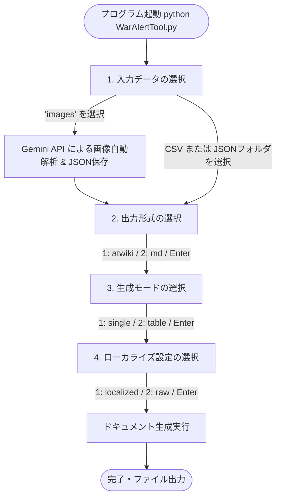

# WarAlert ユニットデータ管理システム

本システムは、ゲーム「WarAlert」のユニット画面スクリーンショット画像から、Gemini APIを利用してパラメータを自動解析・データ化し、アットウィキ（@wiki）または一般のMarkdown（MD）形式のテーブルや個別紹介カードを一気通貫で自動生成するためのツールです。

---

## 1. システム全体フロー

本システムは、スクリーンショット画像や既存のデータを読み込み、Wiki/Markdownドキュメントを出力します。

```
[スクリーンショット画像 (images/)]
      │
      ▼ (WarAlertTool.py で自動解析 & データ化)
[JSONデータ (units/)] ────────┐
                               │ (WarAlertTool.py) ──► [出力ドキュメント (output/)]
[CSVデータ (units.csv)] ───────┘
```

本ツールのメインスクリプトである **`WarAlertTool.py`** を実行するだけで、画像の解析（データ化）からドキュメント生成までノンストップで行うことができます。

---

## 2. 実行方法

### 2.1 ユニットドキュメント生成 (`WarAlertTool.py`)

画像を解析してWikiテキストを作る、または手元のデータを変換します。

#### 事前準備（画像解析を行う場合のみ）
1. プロジェクトのルートディレクトリに `.env` ファイルを作成し、以下のようにAPIキーを記述します：
   ```env
   GEMINI_API_KEY=あなたのGemini_APIキー
   ```
2. `images` フォルダに解析したいスクリーンショット画像を配置します。

#### 実行コマンド
```bash
python WarAlertTool.py
```

#### 対話型UIロードマップ
コマンドを実行すると、コンソール上で以下のフローに沿って設定を尋ねられます。すべての項目で何も入力せずに **`Enter` キー** を押すと、`config.json` に定義されたデフォルト値（推奨設定）で自動実行されます。



1. **入力データの選択**:
   * `images` (本ツールの基本フロー。フォルダ内の画像をGemini APIでデータ化してそのままドキュメントを生成します)
   * `units.csv` (CSVファイルからドキュメントを生成)
   * `units` (すでに解析済みのJSONファイル群からドキュメントを生成)
2. **出力形式の設定**:
   * `1`: `atwiki` (アットウィキのテーブル構文で出力)
   * `2`: `md` (標準的なMarkdownで出力)
3. **生成モードの設定**:
   * `1`: `single` (ユニットごとに個別の詳細カードファイルを生成)
   * `2`: `table` (全ユニットのパラメータを1つにまとめた「比較一覧表」を生成)
4. **ローカライズ設定の設定**:
   * `1`: `localized` (英語の区分値データを日本語に変換して出力。例: `"gold"` -> `"金"`)
   * `2`: `raw` (JSON内の生データのまま出力。例: `"gold"` -> `"gold"`)

---

### 2.2 画像データからの自動解析 (`parse_images.py`)

スクリーンショット画像から、Gemini APIを利用して自動的にパラメータを抽出し、JSONデータを作成します。

#### 事前準備
1. プロジェクトのルートディレクトリに `.env` ファイルを作成し、以下のようにAPIキーを記述します：
   ```env
   GEMINI_API_KEY=あなたのGemini_APIキー
   ```
2. `images` フォルダに解析したいスクリーンショット画像を配置します。

#### 実行コマンド
```bash
python parse_images.py
```
解析が完了すると、`units` フォルダ内に解析結果のJSONファイル（例：`ヴルフラーメン40.json`）が自動生成されます。

---

## 3. 設定ファイル仕様 (`config.json`)

デフォルトの動作設定を管理します。

```json
{
  "output_format": "atwiki",
  "generation_mode": "single",
  "localize": "localized",
  "output_dir": "output",
  "image_dir": "images",
  "json_dir": "units"
}
```

* `output_format`: 出力形式のデフォルト値 (`"atwiki"` または `"md"`)
* `generation_mode`: 生成モードのデフォルト値 (`"single"` または `"table"`)
* `localize`: ローカライズ設定のデフォルト値 (`"localized"` または `"raw"`)
* `output_dir`: 生成されたファイルの出力先フォルダ名
* `image_dir`: 解析対象のスクリーンショットを配置する入力画像フォルダ名
* `json_dir`: 画像から解析したJSONデータを保存する出力JSONフォルダ名

---

## 4. データスキーマ定義

JSONファイルに保存されるデータのスキーマ仕様です。

### ユニットデータ基本構造 (UnitData)

| フィールド名 | 型 | 説明 | 許容値 / 区分値 |
| :--- | :--- | :--- | :--- |
| `name` | `str` | ユニット名。 | 任意の文字列 |
| `rarity` | `str` (Enum) | レア度。 | `"gold"`, `"purple"`, `"blue"`, `"white"` |
| `faction` | `str` (Enum) | 陣営。 | `"germany"`, `"usa"`, `"ussr"` |
| `level` | `int` \| `null` | レベル。 | 任意の正の整数 |
| `description` | `str` | ユニットの説明文。 | 任意の文字列 |
| `costs` | `Costs` | 生産コスト情報。 | 下記 `Costs` の構造を参照 |
| `status` | `Status` | ステータス情報。 | 下記 `Status` の構造を参照 |
| `skills` | `List[Skill]` | スキル情報のリスト。 | 下記 `Skill` の構造を参照（最大3つ） |

#### 生産コスト構造 (Costs)
* `supplies` (int | null): 物資コスト
* `oil` (int | null): 石油コスト
* `manpower` (int | null): 人的資源コスト
* `slots` (int | null): 編成スロット数
* `cooldown` (int | null): 生産クールタイム（秒数）

#### ステータス構造 (Status)
* `hp` (float | null): 最大HP基本値
* `hp_growth` (float | null): 最大HPのレベルアップ上昇値
* `damage` (float | null): ダメージ基本値
* `damage_growth` (float | null): ダメージのレベルアップ上昇値
* `armor` (float | null): 装甲
* `piercing` (float | null): 穿甲
* `speed` (float | null): 移動速度
* `range` (float | null): 最大攻撃距離
* `front_armor` (float | null): 正面装甲
* `side_back_armor` (float | null): 後側方装甲
* `turret_speed` (float | null): 砲塔回転速度
* `vision` (float | null): 視界
* `hit_area` (float | null): 被弾面積

#### スキル構造 (Skill)
* `name` (str): スキル名
* `type` (str / Enum): スキルの動作タイプ (`"active"` または `"passive"`)
* `description` (str): スキル説明文
* `cooldown` (int | null): クールタイム（秒数）

---

## 5. 区分値マッピング仕様

プログラムおよびドキュメント間での日本語と英語の相互マッピング仕様です。

| 項目 | 英語（JSONスキーマ値） | 日本語（CSV値およびドキュメント出力表示） |
| :--- | :--- | :--- |
| **レア度 (rarity)** | `"gold"`<br>`"purple"`<br>`"blue"`<br>`"white"` | `"金"`<br>`"紫"`<br>`"青"`<br>`"白"` |
| **陣営 (faction)** | `"germany"`<br>`"usa"`<br>`"ussr"` | `"ドイツ"`<br>`"アメリカ"`<br>`"ソ連"` |
| **スキルタイプ (type)** | `"active"`<br>`"passive"` | `"アクティブ"`<br>`"パッシブ"` |

> [!NOTE]
> `WarAlertTool.py` で CSV ファイル（`units.csv`）をインプットとする際は、人間が手動編集しやすいようにCSV内の値を「日本語」のまま受け入れ、パース時にプログラム内部で上記の「英語」へ暗黙的に変換して処理を行います。

---

## 6. 入力CSVの形式

複数のユニットデータを一括管理・入力する際のCSVの列構成（ヘッダー名）です。

* **基本情報**: `名前`, `陣営`, `レア度`, `レベル`, `説明`
* **生産コスト**: `物資`, `石油`, `人的資源`, `編成スロット`, `生産クールタイム`
* **ステータス**: `最大HP`, `HP上昇値`, `ダメージ`, `ダメージ上昇値`, `装甲`, `穿甲`, `移動速度`, `最大攻撃距離`, `正面装甲`, `後側方装甲`, `砲塔回転速度`, `視界`, `被弾面積`
* **スキル情報** (最大3つまで登録可能):
  * スキル1: `スキル1_名前`, `スキル1_タイプ` (アクティブ/パッシブ), `スキル1_説明`, `スキル1_クールタイム`
  * スキル2: `スキル2_名前`, `スキル2_タイプ`, `スキル2_説明`, `スキル2_クールタイム`
  * スキル3: `スキル3_名前`, `スキル3_タイプ`, `スキル3_説明`, `スキル3_クールタイム`
